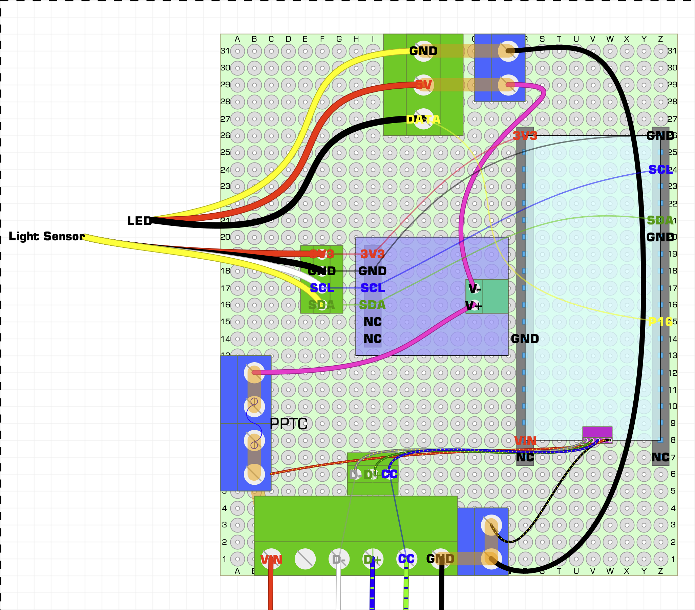

# Hardware

## BOM

### mechanical and cables

- Kradex Z58JH PS enclosure
- M2 thread adapters and nuts (my perf-board is M2)
- PG-29 cable gland for LED and I2C
- USB-C screwable socket with nut, must be designed for data and PD (24AWG)
- USB-C 2.0 plug with wires (simple USB-C to USB-C data cable cut in half works)
- spare 24AWG wire for power (and USB data connection between terminal blocks)
- Kynar wire wrap for signals and 3V3 rail
- JST-SM 3pin socket on 20cm cable for LED
- JST XH 2.54 4pin on 20cm cable for I2C sensor:
  - with socket on one end for board
  - with plug on one end for sensor
- goldpin sockets (2x 1x20) for ESP32

### electrical

- 1m (60 LED/m) RGBW SK6812 LED strip
- 7x9 cm double-sided perf-board
- large screw terminal blocks with 5.08mm raster:
  - 1x 3 pins - for LED
  - 1x 5 pins - for USB power (I used 2x 3pin)
  - 2x 2 pins - for ground and last pass-through 5V+GND before LED terminal block
  - 1x 4 pins - for 5V rail pre-INA219 (I used 2x 2pin)
- small screw terminal blocks with 2.54mm raster:
  - 1x 4 pins - for I2C sensor
  - 2x 3 pins - for USB data and CC
- ESP32 DevKit compatible with NodeMCU-32S ("ESP32S-CP2102-TYPE C") - 38 pins, USB-C
- INA219 current sensor in `GY-219` kit (goldpins and 2pin terminal block)
- BH1750 ambient light sensor in `GY-302` kit
- PPTC for 2.5A hold current - `RUEF250`

## Board layout

Since this is a simple perf-board, I used [DIYLC](https://bancika.github.io/diy-layout-creator/) to plan the layout. It's committed here as [DoorLedStrip.diy](./DoorLedStrip.diy). Ideally, I'd be able to export it as an image that shows the front side with traces hidden and the back side with wires and custom shapes hidden, as well as components visible as outlines only. To keep it easily readable in a repo, I'm just adding a screenshot of the front side with traces and wires on the back set to half-transparent.

